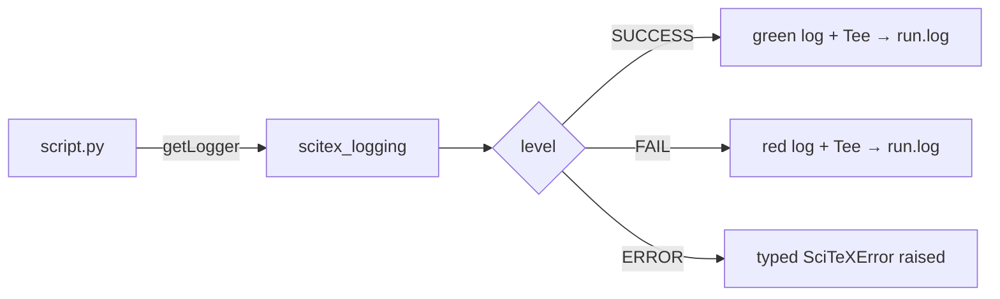

# scitex-logging

<p align="center">
  <a href="https://scitex.ai">
    
  </a>
</p>

<p align="center"><b>Logging utilities for SciTeX — SUCCESS/FAIL log levels, typed exception hierarchy, Tee context-manager.</b></p>

<p align="center">
  <a href="https://scitex-logging.readthedocs.io/">Full Documentation</a> · <code>uv pip install scitex-logging[all]</code>
</p>

<!-- scitex-badges:start -->
<p align="center">
  <a href="https://pypi.org/project/scitex-logging/"></a>
  <a href="https://pypi.org/project/scitex-logging/"></a>
  <a href="https://github.com/ywatanabe1989/scitex-logging/actions/workflows/test.yml"></a>
  <a href="https://github.com/ywatanabe1989/scitex-logging/actions/workflows/install-test.yml"></a>
  <a href="https://codecov.io/gh/ywatanabe1989/scitex-logging"></a>
  <a href="https://scitex-logging.readthedocs.io/en/latest/"></a>
  <a href="https://www.gnu.org/licenses/agpl-3.0"></a>
</p>
<!-- scitex-badges:end -->

---

## Problem and Solution

| # | Problem | Solution |
|---|---------|----------|
| 1 | **stdlib `logging` has only 5 levels** -- experiment scripts want a distinct SUCCESS and FAIL signal that stands out in `grep` | **SUCCESS + FAIL levels added** -- color-coded, level-aware handlers; drop-in compatible with `getLogger(__name__)` |
| 2 | **`raise ValueError("shape mismatch")` loses context** -- every package rolls its own exception hierarchy | **30+ typed exceptions** -- `SciTeXError` root + `ShapeError`, `DTypeError`, `ConfigKeyError`, `PDFDownloadError`, ...; `isinstance(e, DataError)` catches the whole class |
| 3 | **Tee stdout-to-file is a recipe** -- every script implements it differently | **`Tee("run.log")` context-manager** -- one import, no boilerplate |

## Installation

```bash
pip install scitex-logging
```

## 1 Interfaces

<details open>
<summary><strong>Python API</strong></summary>

<br>

```python
import scitex_logging

# Configure logging
scitex_logging.configure(level=scitex_logging.INFO, enable_file=True)

# Get a logger
import logging
logger = logging.getLogger(__name__)
logger.info("Hello from SciTeX logging")

# Tee stdout/stderr to log files
import sys
sys.stdout, sys.stderr = scitex_logging.tee(sys)

# Custom error classes
from scitex_logging import SciTeXError, SaveError

# Warning utilities
from scitex_logging import warn_deprecated, warn_performance

# LLM session log parsing
log = scitex_logging.llm.load("session.jsonl")
log.summary()
log.render("out.html")
```

</details>

## Architecture

```
scitex_logging/
├── _config.py            ← `configure()` entry point + level registration
├── _levels.py            ← SUCCESS / FAIL custom log levels
├── _tee.py               ← stdout/stderr Tee context-manager
├── exceptions/           ← 30+ typed `SciTeXError` subclasses
│   ├── _data.py          ← ShapeError, DTypeError, ...
│   ├── _config.py        ← ConfigKeyError, ...
│   └── _network.py       ← PDFDownloadError, ...
├── warnings/             ← `warn_deprecated`, `warn_performance`
└── llm/                  ← Claude / LLM session-log parsers
```

## Demo



```python
import logging, scitex_logging as sxl

sxl.configure(level=sxl.INFO, enable_file=True)
log = logging.getLogger(__name__)

log.success("model converged")    # green
log.fail("validation failed")     # red, distinct from ERROR
```

```
2026-05-07 12:00:00 SUCCESS  model converged
2026-05-07 12:00:01 FAIL     validation failed
```

## Part of SciTeX

`scitex-logging` is part of [**SciTeX**](https://scitex.ai). Install via
the umbrella with `pip install scitex[logging]` to use as
`scitex.logging` (Python).

>Four Freedoms for Research
>
>0. The freedom to **run** your research anywhere — your machine, your terms.
>1. The freedom to **study** how every step works — from raw data to final manuscript.
>2. The freedom to **redistribute** your workflows, not just your papers.
>3. The freedom to **modify** any module and share improvements with the community.
>
>AGPL-3.0 — because we believe research infrastructure deserves the same freedoms as the software it runs on.

## License

AGPL-3.0-only — see [LICENSE](LICENSE).

---

<p align="center">
  <a href="https://scitex.ai" target="_blank"></a>
</p>
